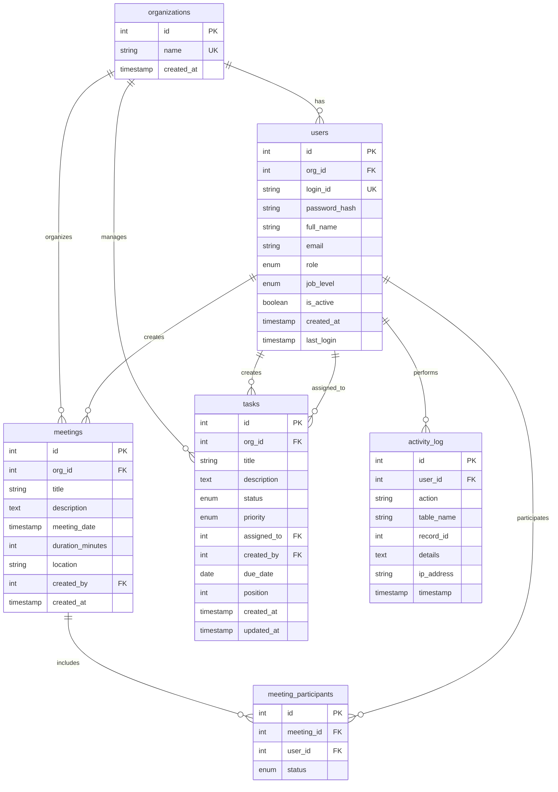

# FlowDeck - Technical Documentation

## Overview
FlowDeck is a comprehensive employee management web application built with Flask and SQLite3. It provides organization management, employee tracking, task assignment, meeting scheduling, and kanban board functionality with role-based access control.

---

## Database Architecture

### Entity Relationship Diagram



### Table Descriptions

**1. organizations** - Stores company/organization information supporting multi-tenancy  
**2. users** - Employee and admin accounts with role-based access  
**3. meetings** - Meeting records with date, location, and creator  
**4. meeting_participants** - Links users to meetings with acceptance status  
**5. tasks** - Task items with status tracking and priority levels  
**6. activity_log** - Audit trail of all user actions for security and compliance  

---

## Database Triggers

FlowDeck implements 6 SQLite triggers for data integrity and audit logging:

### 1. **update_last_login**
- **Event:** After password update on users table
- **Purpose:** Automatically updates the `last_login` timestamp when user credentials are verified
- **Benefit:** Tracks user activity without manual timestamp management

### 2. **log_user_creation**
- **Event:** After insert on users table
- **Purpose:** Automatically creates an activity log entry when new user is created
- **Details:** Logs user name and role in activity_log for audit trail

### 3. **log_user_deletion**
- **Event:** Before delete on users table
- **Purpose:** Records user deletion in activity log before the record is removed
- **Benefit:** Maintains audit history even after data deletion

### 4. **update_task_timestamp**
- **Event:** After update on tasks table
- **Purpose:** Automatically updates `updated_at` timestamp whenever task is modified
- **Benefit:** Tracks task modification history automatically

### 5. **log_task_status_change**
- **Event:** After status update on tasks table
- **Purpose:** Logs every task status change (todo → in_progress → review → done)
- **Details:** Records old and new status in activity_log for workflow tracking

### 6. **prevent_last_admin_deletion**
- **Event:** Before delete on users table (admin role only)
- **Purpose:** Prevents deletion of the last admin in an organization
- **Benefit:** Ensures every organization always has at least one admin user

---

## Application Modules

### 1. Authentication & Authorization (`app.py`)
- **Two-level authentication**: Separate employee and admin login flows
- **Role-based access control**: Admin-only routes protected with decorators
- **Session management**: Flask-Login handles user sessions
- **Password security**: Werkzeug hashing with format `firstname@123`

### 2. Admin Console (`/admin`)
- **Employee Management**: Create, edit, deactivate users
- **Credential Generation**: Auto-generates login IDs from full names (e.g., `johndoe`, `johndoe1`)
- **Password Reset**: Resets employee passwords to `firstname@123` format
- **Statistics Dashboard**: Shows employee count, total tasks, and meetings

### 3. Meeting Management (`/meetings`)
- **CRUD Operations**: Create, view meetings with participants
- **Participant Tracking**: Add multiple participants to meetings
- **Status Management**: Participants can accept/decline invitations
- **Privacy Controls**: Users only see meetings they created or are invited to

### 4. Task Management (`/tasks`)
- **Task Assignment**: Assign tasks to employees with priority levels
- **Status Workflow**: todo → in_progress → review → done
- **Privacy Filtering**: Users only see their assigned or created tasks
- **Due Date Tracking**: Optional due dates for task deadlines

### 5. Kanban Board (`/kanban`)
- **Visual Workflow**: 4-column board (To Do, In Progress, Review, Done)
- **Drag-and-Drop**: Move tasks between columns with mouse
- **Real-time Updates**: AJAX calls update task status instantly
- **Color-coded Borders**: Blue (in progress), yellow (review), green (done), gray (todo)
- **Priority Indicators**: Left border color shows task priority

### 6. Organization Management (`/create-organization`)
- **Multi-tenancy Support**: Each organization is isolated
- **Self-service Registration**: New orgs can sign up independently
- **Custom Admin Accounts**: Set custom login IDs and passwords
- **Data Isolation**: Organizations cannot see each other's data

### 7. Dashboard (`/dashboard`)
- **Personal Stats**: My tasks, upcoming meetings, employee count (admin only)
- **Mini Kanban**: Quick view of personal tasks with drag-drop
- **Recent Activity**: Shows user's recent tasks and meetings

---

## Key Features

### Security
- **Password Hashing**: Werkzeug PBKDF2 SHA-256
- **CSRF Protection**: Flask form security
- **SQL Injection Prevention**: Parameterized queries
- **Login ID Format**: Concatenated full names (e.g., `rahulkumar`, `priyasingh1`)

### Data Privacy
- **Task Visibility**: Users only see tasks they created or are assigned to
- **Meeting Privacy**: Users only see meetings they created or are participating in
- **Admin Override**: Admins can view all data across their organization

### Audit & Compliance
- **Activity Logging**: All create, update, delete actions logged
- **IP Address Tracking**: Records user IP for security
- **Automatic Triggers**: 6 database triggers maintain audit trail
- **Timestamp Tracking**: Created/updated timestamps on all records

### User Experience
- **Intuitive UI**: Clean, professional design without emoji icons
- **Responsive Layout**: Works on desktop, tablet, and mobile
- **Real-time Updates**: AJAX for seamless task status changes
- **Modal Popups**: Credential display and confirmations

---

## Technology Stack

- **Backend**: Flask 3.0.0 (Python web framework)
- **Database**: SQLite3 with foreign keys and triggers
- **Authentication**: Flask-Login 0.6.3
- **Password Security**: Werkzeug 3.0.1
- **Frontend**: HTML5, CSS3, Vanilla JavaScript
- **UI Pattern**: Server-side rendering with Jinja2 templates

---

## Deployment Notes

### Default Credentials
- **Admin Login**: `admin` / `admin123`
- **Employee Login**: `{firstname}{lastname}` / `{firstname}@123`

### Database Initialization
The database is stored in the `instance/` folder for better organization and security.
Run `python database.py` to initialize tables, triggers, and default admin.

### Database Location
- **Path**: `instance/flowdeck.db`
- **Folder**: Automatically created on first run
- **Git**: Protected by `.gitignore` (not committed to version control)

### Running Application
```bash
source venv/bin/activate
python app.py
```

**Server Access:**
- **Local**: `http://127.0.0.1:5000`
- **Network**: `http://<your-ip>:5000` (displayed on startup)
- **Network Access**: Other devices on same Wi-Fi can connect using network IP

**Network Requirements:**
- All devices on same Wi-Fi network
- Firewall allows port 5000
- On macOS: Allow Python in Security & Privacy settings

---

*FlowDeck v1.0 - Professional Employee Management System*
